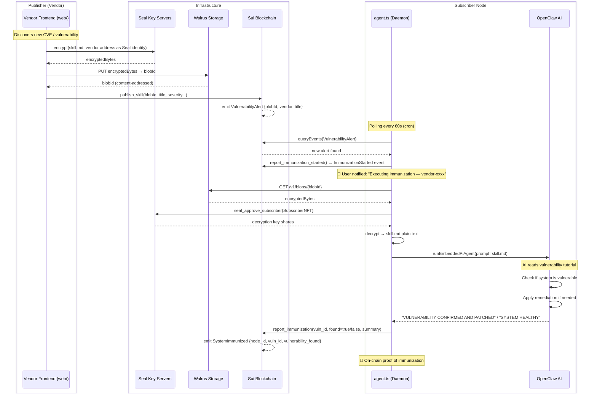

# Sui Immunizer 🛡️

> **Decentralized, AI-powered vulnerability response** — Powered by [Seal](https://seal.mystenlabs.com/) + [Walrus](https://walrus.site) + [Sui](https://sui.io) + [OpenClaw](https://openclaw.ai)

---

## What is Sui Immunizer?

Sui Immunizer is a **digital vaccine distribution system** for Web3 infrastructure. Security vendors publish encrypted remediation skills to the Sui blockchain. Subscribers' servers automatically detect, decrypt, and execute these skills via an AI agent — no human in the loop.

```
Vendor discovers CVE → encrypts skill.md → publishes on Sui
                                                    ↓
Subscriber's server auto-detects → AI agent reads the tutorial
                                                    ↓
AI checks if system is vulnerable → patches if needed → reports on-chain
```

---

## How It Works



---

## Project Structure

```
sui-immunizer/
├── web/                        # Next.js 16 dashboard (publisher + subscriber UI)
│   └── src/
│       ├── app/page.tsx        # Main dashboard (vendor/subscriber roles)
│       ├── app/providers.tsx   # Sui + Slush wallet providers
│       └── lib/seal.ts         # Seal/Walrus utility functions
│
├── src/                        # Backend agent (runs on subscriber's server)
│   └── agent.ts                # Main daemon: poll → decrypt → AI execute → report
│
├── move/                       # Sui Move smart contract
│   └── sources/immunizer.move  # SkillBlob, seal_approve, ImmunizationStarted, SystemImmunized
│
└── scripts/
    └── install-cron.sh         # System cron setup for the agent daemon
```

---

## Roles

| Role | What they do |
|---|---|
| **Vendor** | Security researcher. Publishes `skill.md` encrypted with Seal via the web dashboard. Holds a `VendorNFT`. |
| **Subscriber** | Server operator. Pays vendor-set price (default 1 SUI) per 30-day subscription. Agent daemon auto-executes skills. Holds a `SubscriberNFT`. |
| **AI Agent** | OpenClaw instance on subscriber's server. Reads the skill tutorial, checks system, applies fixes. |

---

## Encryption & Access Control

| Layer | Technology | Role |
|---|---|---|
| Encryption | **Seal** (threshold BLS) | Vendor encrypts `skill.md`. Only NFT holders can decrypt. |
| Storage | **Walrus** | Decentralized blob storage. Immutable `blobId` on-chain. |
| Access Policy | **Move** `seal_approve_*` | Key servers call the contract to verify `SubscriberNFT` / `VendorNFT` |
| Execution | **OpenClaw** `runEmbeddedPiAgent` | AI agent runs the remediation tutorial on the server |

---

## Quick Start

### 1. Deploy Move Contract

```bash
cd move
sui client publish --gas-budget 100000000
# Save the Package ID and Registry object IDs
```

### 2. Configure Environment

```bash
cp env.example .env
```

```env
# Agent wallet with SubscriberNFT
SUI_MNEMONIC="word1 word2 ... word12"
SUI_NETWORK=testnet

# Contract addresses (from step 1)
IMMUNIZER_PACKAGE_ID=0x...
IMMUNIZER_REGISTRY_ID=0x...

# OpenClaw settings
OPENCLAW_PROVIDER=anthropic
OPENCLAW_MODEL=claude-sonnet-4-20250514
OPENCLAW_WORKSPACE=~/.openclaw/workspace/immunizer
OPENCLAW_NOTIFY_SESSION_KEY=main:telegram:immunizer
```

### 3. Install OpenClaw

```bash
curl -fsSL https://openclaw.ai/install.sh | bash
openclaw onboard --install-daemon
# Connect your notification channel (Telegram / WhatsApp)
openclaw channels login
openclaw gateway --port 18789
```

### 4. Start the Immunizer Agent

```bash
# One-shot
bun src/agent.ts

# Install as system cron (runs every 60s)
chmod +x scripts/install-cron.sh
./scripts/install-cron.sh

# Monitor logs
tail -f logs/immunizer.log
```

### 5. Frontend (Publisher / Subscriber Dashboard)

```bash
cd web
cp .env.local.example .env.local   # fill in PACKAGE_ID, REGISTRY_ID
bun dev
# Open http://localhost:3000
```

---

## Notification Flow

When the agent detects and executes a skill, you receive messages via your OpenClaw channel (Telegram/WhatsApp):

```
🚨 Sui Immunizer: New vulnerability patch detected
   From vendor-0x1234... · Severity 9
   "Remote Code Execution in XYZ Library"
   Executing immunization...

—— [A few minutes later] ——

💉 Sui Immunizer: Immunization complete
   Vulnerability confirmed and patched ✅
   CVE-2026-XXXX written to on-chain state
   TX: 0xabc...
```

or

```
✅ Sui Immunizer: System healthy
   Your system is not affected by CVE-2026-XXXX
   No further action required
```

---

## On-Chain Data Model

```
SkillBlob (shared object)
├── vuln_id      : String     — CVE identifier
├── title        : String     — Public summary (visible to all)
├── description  : String     — Short public description
├── severity     : u8         — 1-10
├── blob_id      : String     — Walrus blob ID (Seal-encrypted content)
├── vendor       : address    — Publisher address
└── created_at   : u64        — Timestamp

Events:
├── VulnerabilityAlert       — Emitted on publish_skill()
├── ImmunizationStarted      — Emitted when agent begins execution
└── SystemImmunized          — Emitted with vulnerability_found + summary
```

---

## Security Model

- **Publishers** are whitelisted via `VendorNFT` — only admin can mint
- **Subscribers** hold `SubscriberNFT` which expires after 30 days unless renewed
- **skill.md content** is never stored in plaintext anywhere — Seal threshold encryption ensures both key servers must cooperate to decrypt
- **Agent wallet** only needs read permissions — `report_immunization` writes only an event, not mutable state
- **OpenClaw** runs locally on the subscriber's server — skill content never leaves the machine

---

## License

MIT
