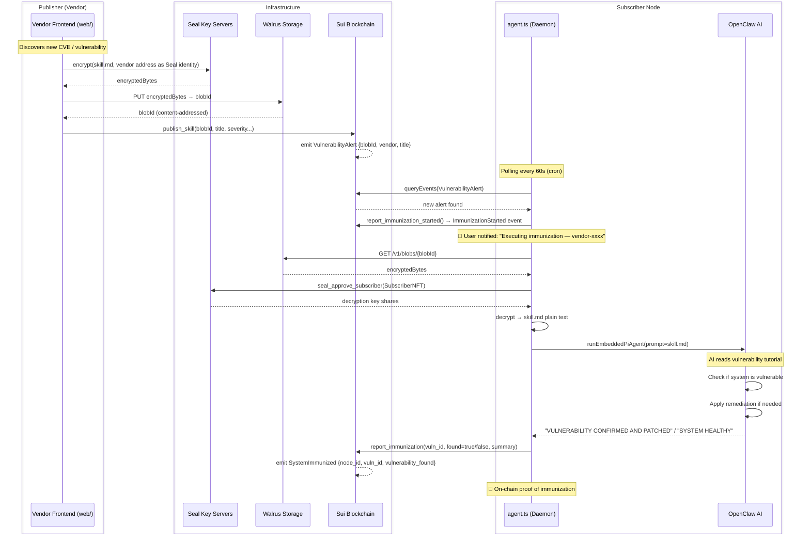

```mermaid
sequenceDiagram
    box Publisher (Vendor)
        participant V as Vendor Frontend (web/)
    end
    box Infrastructure
        participant S as Seal Key Servers
        participant W as Walrus Storage
        participant C as Sui Blockchain
    end
    box Subscriber Node
        participant A as agent.ts (Daemon)
        participant O as OpenClaw AI
    end

    Note over V: Discovers new CVE / vulnerability

    V->>S: encrypt(skill.md, vendor address as Seal identity)
    S-->>V: encryptedBytes
    V->>W: PUT encryptedBytes → blobId
    W-->>V: blobId (content-addressed)
    V->>C: publish_skill(blobId, title, severity...)
    C-->>C: emit VulnerabilityAlert {blobId, vendor, title}

    Note over A: Polling every 60s (cron)
    A->>C: queryEvents(VulnerabilityAlert)
    C-->>A: new alert found

    A->>C: report_immunization_started() → ImmunizationStarted event
    Note over A: 🔔 User notified: "Executing immunization — vendor-xxxx"

    A->>W: GET /v1/blobs/{blobId}
    W-->>A: encryptedBytes
    A->>S: seal_approve_subscriber(SubscriberNFT)
    S-->>A: decryption key shares
    A->>A: decrypt → skill.md plain text

    A->>O: runEmbeddedPiAgent(prompt=skill.md)
    Note over O: AI reads vulnerability tutorial
    O->>O: Check if system is vulnerable
    O->>O: Apply remediation if needed
    O-->>A: "VULNERABILITY CONFIRMED AND PATCHED" / "SYSTEM HEALTHY"

    A->>C: report_immunization(vuln_id, found=true/false, summary)
    C-->>C: emit SystemImmunized {node_id, vuln_id, vulnerability_found}
    Note over A: 🎉 On-chain proof of immunization
```